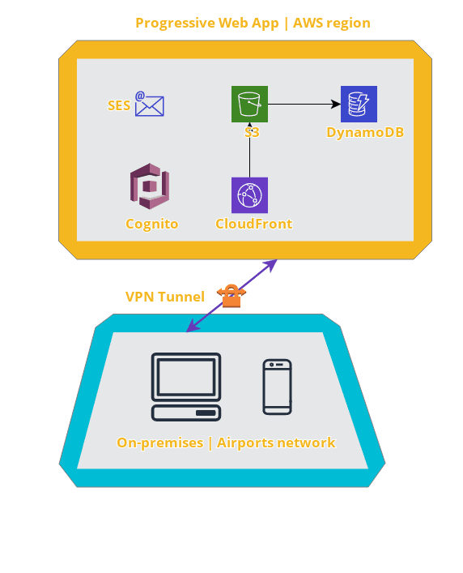
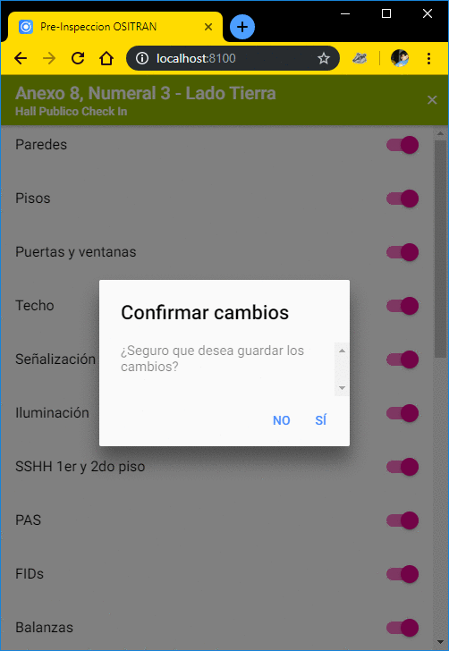

# Ositran APP - (Ionic progressive web app)
https://cloudcraft.co/view/2ff1cbc0-f799-484f-9a91-742678d51aff?key=CDbc_waeDKSAeiSgF8-wOw



### Running the app
npm install ionic
npm install @ionic/app-scripts@latest --save-dev  

Now the app is configured and wired up to the AWS Mobile Hub and AWS services. To run the app in the browser, run

ionic serve  

To run the app on device, first add a platform, and then run it:

```bash
ionic cordova platform add ios
ionic cordova run ios
```

